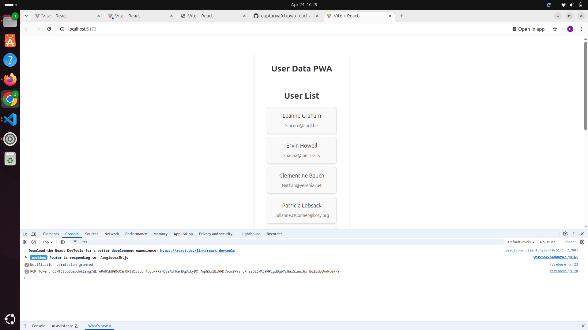

# React + Vite

This template provides a minimal setup to get React working in Vite with HMR and some ESLint rules.

Currently, two official plugins are available:

- [@vitejs/plugin-react](https://github.com/vitejs/vite-plugin-react/blob/main/packages/plugin-react) uses [Babel](https://babeljs.io/) for Fast Refresh
- [@vitejs/plugin-react-swc](https://github.com/vitejs/vite-plugin-react/blob/main/packages/plugin-react-swc) uses [SWC](https://swc.rs/) for Fast Refresh

## Expanding the ESLint configuration

If you are developing a production application, we recommend using TypeScript with type-aware lint rules enabled. Check out the [TS template](https://github.com/vitejs/vite/tree/main/packages/create-vite/template-react-ts) for information on how to integrate TypeScript and [`typescript-eslint`](https://typescript-eslint.io) in your project.


# 📱 E-Commerce PWA

This project is a simple **Progressive Web App (PWA)** built with **React + Vite** that supports offline functionality, push notifications via **Firebase Cloud Messaging (FCM)**, and a web app manifest for installation on mobile devices.

---

## 📦 Features

- Offline support via a custom `service worker`
- Push notifications using **Firebase Cloud Messaging**
- Installable web app via a `manifest.webmanifest`
- React Router for navigation
- Modular component structure

---

## 📜 Steps to Configure `manifest.webmanifest`

1. Create a file named `manifest.webmanifest` in your `/public` directory.
2. Add the following configuration:

```json
{
  "short_name": "E-Shop",
  "name": "E-Commerce Progressive Web App",
  "icons": [
    {
      "src": "favicon.ico",
      "sizes": "64x64 32x32 24x24 16x16",
      "type": "image/x-icon"
    },
    {
      "src": "icon-192.png",
      "type": "image/png",
      "sizes": "192x192"
    },
    {
      "src": "icon-512.png",
      "type": "image/png",
      "sizes": "512x512"
    }
  ],
  "start_url": ".",
  "display": "standalone",
  "theme_color": "#000000",
  "background_color": "#ffffff"
}
```





